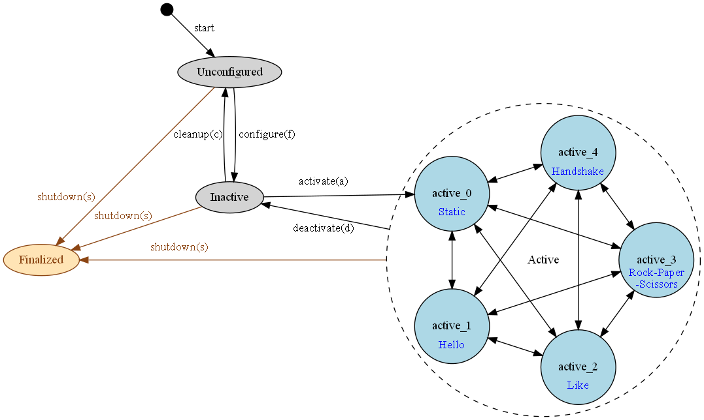

# unitree-g1-brainco-hand

English Version | [中文版](./README.md)

Tutorial on adapting BrainCo Revo2 hands for Unitree G1 robot. Install, setup and a simple demo.

## Repository Overview

### brainco_ws

G1 arm IK calculation is based on [Unitree/xr_teleoperate](https://github.com/unitreerobotics/xr_teleoperate/blob/main/teleop/robot_control/robot_arm_ik.py). Dual-arm dual-hand control is based on ROS2.
- Main control [smach_action.py](./brainco_ws/src/control_py/control_py/smach_action.py)
- State machine transition client [keyboard_call.py](./brainco_ws/src/control_py/control_py/keyboard_call.py)


### ros2_stark_ws

Difference between this SDK version and [the original version](https://github.com/BrainCoTech/stark-serialport-example/tree/revo2/ros2_stark_ws):  
The BrainCo hands communicates with Unitree G1 via **dual 485** serial ports, i.e., in a single ROS node, the left and right hands communicate simultaneously through `/dev/ttyUSB0` and `/dev/ttyUSB1`.
- Brainco hands [stark_node.cpp](./ros2_stark_ws/src/ros2_stark_controller/src/stark_node.cpp)


## Tutorial

Tutorial video (to be added)

### Robot Startup
1. Power on Unitree G1 by refering to [Unitree Documentation Center|Operational Guidance](https://support.unitree.com/home/en/G1_developer/quick_start). When the robot powered, the hands' LED will light up and the fingers will reset automatically.
2. Wait about 1 minute until G1 enters **Zero Torque Mode**, meaning joints can move freely without resistance.
3. Use the remote controller and press the corresponding buttons to switch the robot sequentially into **Damping Mode** → **Ready Mode**. (Note: For arm development, do not enter **Motion Mode**.)

### Remote Connection
Based on [Unitree Documentation Center|Quick Start](https://support.unitree.com/home/en/G1_developer/quick_development):
1. For the first connection, use an Ethernet cable to connect G1 and your computer. Set the computer’s IP to the same subnet as G1: `192.168.123.XXX`, e.g.:
```
IP          192.168.123.222
Subnet      255.255.255.0
Gateway     192.168.1.1
DNS         192.168.1.1
```

2. Open **VSCode**, install the **Remote SSH** extension, click **New Remote**, and enter:
```sh
ssh unitree@192.168.123.164
```
Enter the password (default: `123`). Once connected, open the folder `/home/unitree/` to access all the files.

3. Open a new terminal, input `1` (to select ROS environment **Foxy**), then press Enter. To re-select the ROS environment, run `source ~/.bashrc`.

4. Configure WiFi: [Unitree Documentation Center|FAQ](https://support.unitree.com/home/en/G1_developer/FAQ) → Jetson Orin Nx WIFI Configuration method → STA pattern → nmcli Configures the WIFI mode

If your `<SSID>` or password contains **special characters, Chinese characters, or spaces**, wrap them in quotes, e.g.:
```sh
nmcli device wifi connect "My WiFi" password "mypass@123!"
```
If error `Not authorized` occurs, add `sudo`.

5. Set a fixed remote IP: 
```sh
# Show wlan0 details
nmcli device show wlan0

# Check if IP is free
nmap -sn 192.168.13.60
# If "Host seems down", this IP is free to use.

# Example: fix IP to 192.168.13.60
sudo nmcli connection modify <SSID> ipv4.method manual \
    ipv4.addresses 192.168.13.60/23 \
    ipv4.gateway 192.168.13.1 \
    ipv4.dns "192.168.13.1 8.8.8.8"

# Reconnect
sudo nmcli connection down <SSID> && sudo nmcli connection up <SSID>
```


### Environment Dependencies
1. Install Miniconda. Visit [Miniconda Pages](https://www.anaconda.com/docs/getting-started/miniconda/main), choose system: `Linux`, architecture: `ARM64`, and install miniconda using the provided commands.

2. Create a conda environment named `g1brainco` with **Python 3.8**:
```sh
conda create -n g1brainco python=3.8
conda activate g1brainco
```
3. Install dependencies in the new environment:
```sh
# Arm Motion Control
conda install pinocchio -c conda-forge
pip install meshcat
pip install transitions
# Compile ROS2 in the conda environment
pip install rospkg
pip install -U colcon-common-extensions
# Others
pip install matplotlib
pip install empy==3.3.2
pip install lark-parser
```

### Install Unitree ROS2
1. Based on [Unitree Documentation Center|Ros2 Communication Routine](https://support.unitree.com/home/en/G1_developer/ros2_communication_routine), install and compile `unitree_ros2`.

2. Open `~/unitree_ros2/setup.sh`, change `"enp3s0"` to `"eth0"`
```xml
export CYCLONEDDS_URI='<CycloneDDS><Domain><General><Interfaces>
                            <NetworkInterface name="eth0" priority="default" multicast="default" />
                        </Interfaces></General></Domain></CycloneDDS>'
```

### Install BrainCo Hand SDK
1. Download this repository to G1:
- Method 1: 
```sh
cd ~
git clone https://github.com/BrainCoTech/unitree-g1-brainco-hand.git
```
- Method 2:  
Download locally and upload:
```sh
scp -r unitree-g1-brainco-hand unitree@192.168.XXX.XXX:/home/unitree/
```

2. Set execution permissions:
```sh
cd ~/unitree-g1-brainco-hand/brainco_ws 
chmod +x ./launch/launch_trans.sh
chmod +x ./launch/launch_robot.sh
```

### Configure BrainCo Hands
Open `ros2_stark_ws/src/ros2_stark_controller/config/params_v2_double.yaml`and modify parameters if needed (You can use default settings).  
- `port_l, port_r`: Left and right hand serial ports, corresponding to USB-485 adapter`485_A, 485_B`.
- `baudrate`: Baud rate.
- `slave_id_l, slave_id_r`: Default for left hand`0x7e` and for right hand `0x7f`.

### Compile

```sh
# Activate conda env
conda activate g1brainco
# Compile brainco_ws
cd ~/unitree-g1-brainco-hand/brainco_ws 
python -m colcon build    
# Compile ros2_stark_ws
cd ~/unitree-g1-brainco-hand/ros2_stark_ws
python -m colcon build          
```


## Demo

Open two terminals simultaneously.

### Terminal 1: Start main control node and hand node
```sh
conda activate g1brainco                    # activate conda env
cd ~/unitree-g1-brainco-hand/brainco_ws     # enter workspace     
./launch/launch_robot.sh                    # run launch.sh
```

Check output:

- Left/right `Port`, `Baudrate`, `slave_id`
- `"serial port opened"`
- `"Waiting for joint cmd ..."`
If error occurs, check parameters in `ros2_stark_ws/src/ros2_stark_controller/config/params_v2_double.yaml`.

- `"IK initialization done."`
- `"Request 'configure' to start"`
Then you can send state transition requests.


### Terminal 2: Start state transition client node
```sh
conda activate g1brainco                    # activate conda env
cd ~/unitree-g1-brainco-hand/brainco_ws     # enter workspace       
./launch/launch_trans.sh                    # run launch.sh
```

### State Transition Requests
Terminal 2 will show current state, available transitions, and corresponding actions.  
Enter `string + Enter` to switch states.
After entering **active** state, add `l` or `r` to control left/right hand individually.
Without `l/r`, both hands are controlled.
<p align="center">
  
</p>

## FAQ
[FAQ.md](./FAQ.md).