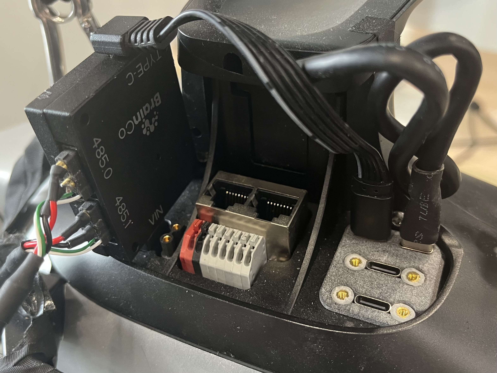
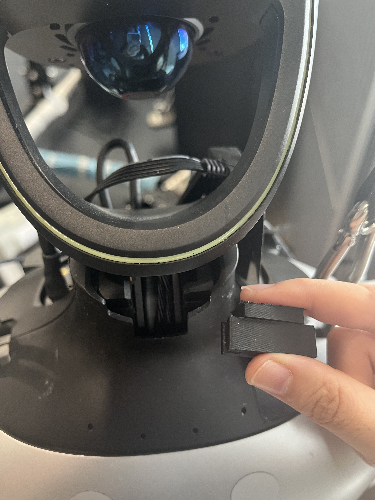
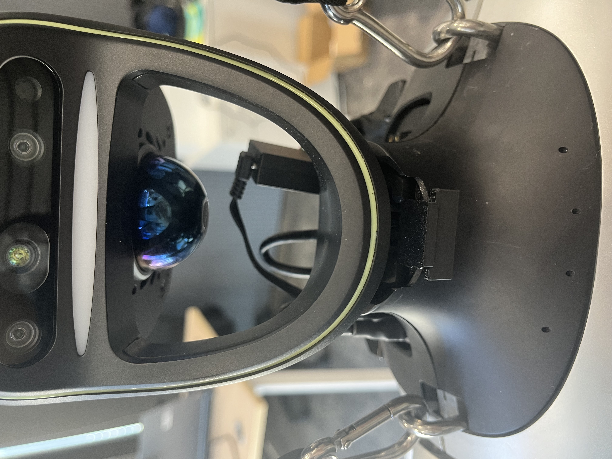

## Dexterous Hand Installation
1. Use a suitable wrist adapter to mount the BrainCo dexterous hand to the end of the Unitree G1 arm, then secure it with screws.
2. Connect the dual RS-485 serial cables to the `485` ports on the left and right hands, and to the `485.0` and `485.1` signal ports on the Unitree G1 USB-to-485 converter board. Connect the power port of the USB-to-485 converter board to electrical interface `2` on the top of the G1, and connect the Type-C communication port to electrical interface `6`. Plug the head camera into any Type-C port.
3. Make sure all connections are secure to prevent loosening or disconnection while the robot is moving.

<p align="center">
  
</p>

## Securing the Head (Camera)
The G1 head is designed as a passive joint that can move forward and backward to help prevent structural damage if the robot falls. To keep the head camera in a fixed position, we designed a [neck support bracket](cad/head_camera_bracket.STEP) to prevent head position drift caused by vibration while walking.

**Note:** If there is a risk of falling and the camera is not needed, we recommend **removing** the support bracket to protect the head structure.

<div align="center">
  <table>
    <tr>
      <td align="center">
        
      </td>
      <td align="center">
        
      </td>
    </tr>
  </table>
</div>

## Robot Startup
1. Power on the Unitree G1. You can refer to the [Unitree Documentation Center | Operation Guide](https://support.unitree.com/home/zh/G1_developer/quick_start). When power is connected, the indicator light on the back of the dexterous hand turns on and the fingers automatically reset.
2. After startup, wait until the Unitree G1 enters **Zero Torque Mode (L2 + Y, purple light)**. Then use the remote controller to switch the robot through **Damping Mode (L2 + B, orange light)** -> **Locked Standing Mode (L2 + UP, dark blue light)** -> **(Optional) Normal Motion Control Mode (R1 + X, light blue light)**. The low-level upper-limb controller does not conflict with the high-level walking and running controller.

## Remote Connection
Refer to the [Unitree Documentation Center | Quick Development](https://support.unitree.com/home/en/G1_developer/quick_development).

1. Connect the G1 and the computer with an Ethernet cable, and set the computer's Ethernet IP to the same subnet as the Unitree G1: `192.168.123.XXX`.
2. Access the G1 remotely via SSH (default password: `123`):

```sh
ssh unitree@192.168.123.164
```

3. Open a new terminal, enter `1` (to select the ROS environment as Foxy), and press Enter to enter the ROS 2 environment.
