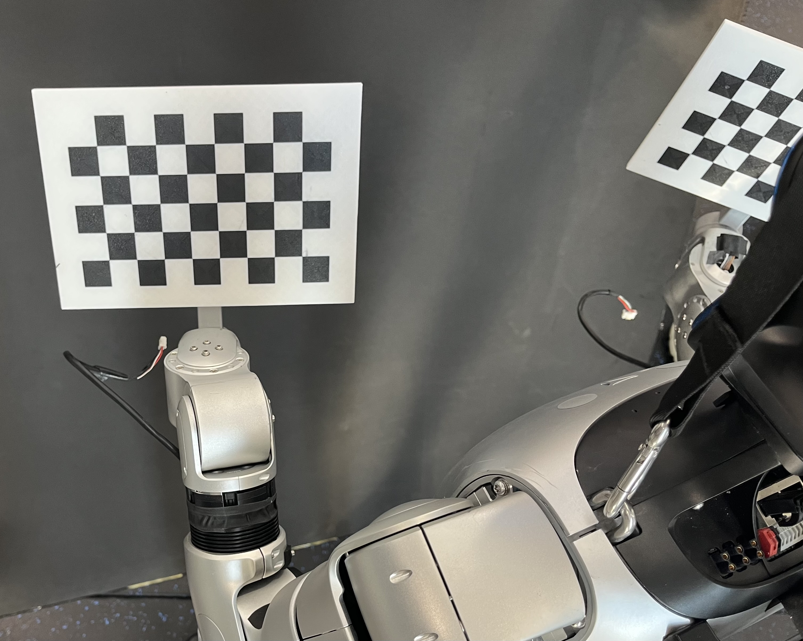

## 示例2：手眼标定

### 1. 机器人配置
修改通用配置 `brainco_ws/src/control_py/config/smach_config.yaml`
```yaml
mode:
	current_mode: calibr # 选择手眼标定模式
```

检查标定配置 `brainco_ws/src/control_py/control_py/state_manager/calibrate/calibrate_config.yaml`
```yaml
paths:
  cam_calibr_dir: /home/unitree/unitree-g1-brainco-hand/cam_calibr

collection:
  move_range: [0.015, 0.015, 0.015, 0.15, 0.15, 0.15]
```
- `cam_calibr_dir`: 标定数据保存目录
- `move_range`: 采集标定数据时机械臂末端随机运动范围

### 2. Unitree 终端1: 启动主控制节点和灵巧手节点

```sh
# 进入工作空间
cd ~/unitree-g1-brainco-hand/brainco_ws 
# 激活环境
conda activate g1brainco 
# (推荐)单独启动手臂运控
./launch/launch_robot.sh arm
```

检查输出信息:
- IK初始化结束 `"IK initialization done."`
- 当显示 `"Request 'configure' to start"` 则可以发送状态转换请求

### 3. Unitree 终端2: 启动 Agent 网络服务

```sh
# 进入工作空间
cd ~/unitree-g1-brainco-hand/brainco_ws 
# 激活 conda 环境
conda activate g1brainco 
# 启动 Agent 服务
./launch/launch_trans.sh agent
```

### 4. 客户端 PC: 打开控制 GUI
```sh
# 进入 client 目录
cd ui_client 
# 激活 conda 环境
conda activate braincogui
# 启动 GUI
python ui_client/ui_client.py
```

### 5. 采集手眼标定数据
先准备好棋盘格标定板。我们提供与 Revo2 手腕同构的棋盘格标定板3D打印文件[标定板(待更新)](./tutorials/cad/calibration_27x27.pdf)和[标定板支架](./tutorials/cad/calibration_bracket.STEP)，自行打印后，可直接替换 Revo2 双手完成标定。

<p align="center">
  
</p>

分别执行左右手标定
```
Init -> Ready -> Active -> Calibr-Left-Start -> Calibr-Right-Start -> Ready
```

采集过程中，程序会自动控制机械臂随机运动并保存数据。默认每侧采集 `20` 组数据。

生成的数据文件：
- 图像：`cam_calibr/imgs/left/`，`cam_calibr/imgs/right/`
- 机械臂位姿：`cam_calibr/arm_pose/left.json`，`cam_calibr/arm_pose/right.json`


### 6. 离线计算标定结果

左右手均采集完成后，检查左右手图像

```sh
cd ~/unitree-g1-brainco-hand/cam_calibr
chmod +x ./imgs/check_img_grid.sh
./imgs/check_img_grid.sh left
./imgs/check_img_grid.sh right
```

离线计算标定参数

```sh
cd ~/unitree-g1-brainco-hand/cam_calibr
python compute_calibration.py
```

运行完成后会生成：
- `cam_calibr/settings.yaml`

该文件包含左右手对应的相机外参，后续 `calibrate` 模式会读取该文件用于坐标转换。


